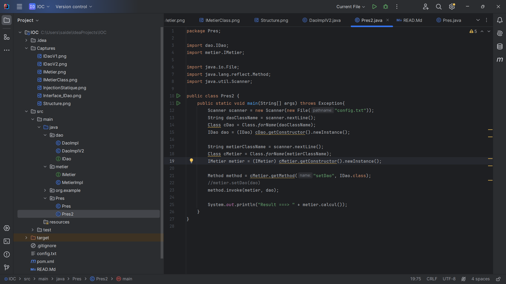
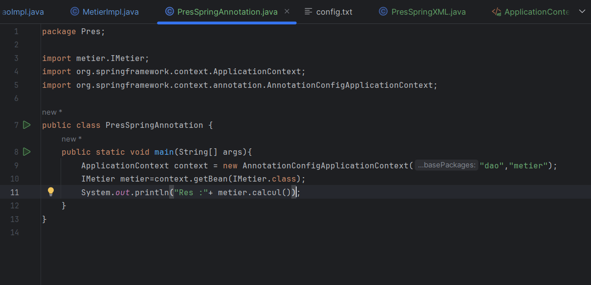

<h1>Structure du projet:</h1>

<h1>Creation de l interface IDao:</h1>

<h3>Cette Interface a deux Implementations</h3>

<h1>L'implementation de IDao version Base de Donnees : </h1>

<h1>L'implementation de IDao version Web Service : </h1>

<h1>Creation de l interface IMetier:</h1>

<h1>Implemetation de L'interface IMetier</h1>

<h2>Couche presentation</h2>
 

<h1>Injection Statique : </h1>

<h1>Injection Dynamique :</h1>

<h1>Version XML :</h1>

<h1>Version Annotation :</h1>

